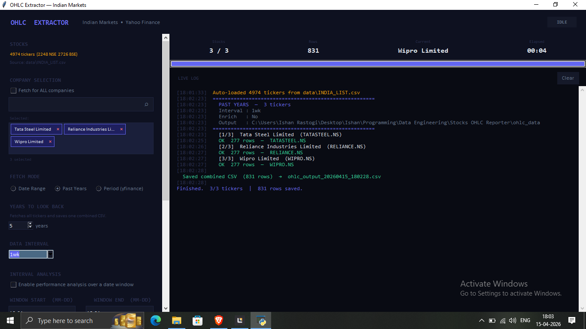

# OHLC Extractor — Indian Markets

A desktop application for fetching, formatting, and saving historical OHLCV data for Indian stocks (NSE / BSE) via Yahoo Finance. Built with Python and Tkinter. Designed around a single goal: producing a clean, analysis-ready dataset of the Indian stock market — suitable for time-series modelling, ML training, and public dataset publishing.




## Table of Contents

- [Requirements](#requirements)
- [Setup](#setup)
- [Stock List](#stock-list)
- [Interface Overview](#interface-overview)
- [Fetch Modes](#fetch-modes)
- [Output Formats](#output-formats)
- [MAX HISTORY](#max-history)
- [Checkpoint & Resume](#checkpoint--resume)
- [Output Files](#output-files)
- [Tips for the Kaggle Use Case](#tips-for-the-kaggle-use-case)


## Setup

```
project/
├── main.py
└── data/
    └── INDIA_LIST.csv
```

Run Program

```python
python -m venv venv

venv\Scripts\activate

pip install -r requirements.txt
```

```python
python main.py
```

The application loads the stock list automatically on startup. No manual import step is needed.


## Stock List

The application reads `data/INDIA_LIST.csv` at launch. Expected columns:

| Column | Description |
| --- | --- |
| `Company_Name` | Human-readable company name |
| `NSE_Symbol` | NSE ticker symbol (e.g. `RELIANCE`) |
| `BSE_Symbol` | BSE ticker symbol (e.g. `500325`) |
| `ON_NSE` | Whether the stock is listed on NSE (`1`, `Y`, `YES`, `TRUE`, or `X`) |
| `ON_BSE` | Whether the stock is listed on BSE (same values) |
| `ISIN`, `Security_Code`, `Face_Value` | Present but not used for fetching |

**Ticker preference:** NSE is always tried first. If NSE returns no data, BSE is used as fallback. This is applied per stock, so a single run can mix `.NS` and `.BO` tickers.


## Interface Overview

The UI is split into a left control panel (scrollable) and a right live log panel.

### Company Selection

By default, **Fetch for ALL companies** is checked — every stock in `INDIA_LIST.csv` will be fetched. Uncheck it to reveal a search box. Type any part of a company name to filter and add individual stocks as tags. Remove a tag by clicking the `×` on it.

### Data Interval

Controls the candlestick frequency. Options: `1d`, `5d`, `1wk`, `1mo`, `3mo`. For the full-market Kaggle dataset, use `1d`.

### Interval Analysis

An optional post-fetch analysis that computes the percentage price change for each company within a recurring annual date window (e.g. October every year). When enabled, a `.txt` report is saved alongside the CSV listing each company's best year, worst year, average return, and trend label (Bull / Bear). The top 3 performers are also shown in the live log.

### Data Enrichment

Fetches additional metadata from Yahoo Finance per ticker: Sector, Industry, Market Cap, PE Ratio, 52-week High/Low, and Dividend Yield. Significantly slower. Not recommended for full-market runs.


## Fetch Modes

Three modes control the date range passed to Yahoo Finance.

### Date Range

Specify an explicit start and end date (`YYYY-MM-DD`). Fetches data within that window for every selected stock.

### Past Years

Enter a number of years to look back from today's date. Internally constructs a start date of `January 1` of that year. Always saves one combined file regardless of the "separate files" setting.

### Period (yfinance)

Passes a period string directly to yfinance: `1d`, `5d`, `1mo`, `3mo`, `6mo`, `1y`, `2y`, `5y`, `10y`, `ytd`, `max`. Use `max` to get the full history available on Yahoo Finance.


## Output Formats

Two independent formats can be saved at the same time.

### Long Format (always available)

The original row-per-day-per-stock structure. Columns:

```
Date | Year | Company | Ticker | Exchange | Open | High | Low | Close | Volume
```

Optionally extended with enrichment columns when **Data Enrichment** is enabled:

```
... | Sector | Industry | MarketCap | PE_Ratio | 52W_High | 52W_Low | DividendYield
```

Can be saved as one combined file or as separate files per company (controlled by the **Save separate CSV per stock** checkbox).

### Pivot / Time-Series Format

Enable this with the **Save Closes-Only pivot** checkbox in the OUTPUT section. Produces a wide matrix — ideal for time-series modelling and ML training — where:

- **Rows** = trading dates
- **Columns** = ticker symbols
- **Cells** = price or volume values
- **Missing cells** = `NaN` (stock not yet listed, or no data for that date)

Three sub-options control what is included:

| Option | Output | Description |
| --- | --- | --- |
| Closes only | `{name}_closes_{ts}.csv` | One file. Close prices only. |
| Closes + Volume — two separate CSVs | `{name}_closes_{ts}.csv` + `{name}_volume_{ts}.csv` | Two files with identical date indexes. Each cell is the close price or volume respectively. The two CSVs are guaranteed to align row-for-row. |
| Closes + Volume — MultiIndex columns | `{name}_pivot_multi_{ts}.csv` | One file. Column header has two rows: the first row is the metric (`Close` or `Volume`), the second is the ticker. |

The pivot format is built directly from per-ticker `pd.Series` objects — it never constructs the full long-format table in memory first, so it scales to the full Indian market without RAM issues.


## MAX HISTORY

The **MAX HISTORY** button (amber, bottom of the control panel) is a dedicated mode for fetching the deepest possible history for every stock in `INDIA_LIST.csv` simultaneously.

It differs from the standard START button in a few ways:

- Always fetches all stocks, ignoring the company selection setting.
- Tries NSE first, falls back to BSE — per stock — with explicit log output for each attempt.
- Accepts either `max` (all data available on Yahoo Finance) or a specific number of years.
- Saves one combined file (separate-per-company is not applicable).
- Supports checkpoint and resume (see below).

Click MAX HISTORY, enter the number of years (or leave as `max`), and click FETCH.


## Checkpoint & Resume

Long-running MAX HISTORY fetches can be interrupted and resumed without losing progress.

### Stopping a run

Click **STOP** at any time. The current ticker finishes, then the application saves everything accumulated so far to a checkpoint folder inside your output directory:

```
{output_dir}/
└── .ohlc_checkpoint/
    ├── meta.json          ← config, done ticker list, stats, timestamp
    ├── closes.csv         ← partial closes pivot (pivot mode)
    ├── volume.csv         ← partial volume pivot (pivot mode)
    └── longformat.csv     ← partial rows (long-format mode)
```

The live log confirms how many tickers were saved and prompts you to resume next time.

### Resuming

The next time you click **MAX HISTORY**, the application detects the checkpoint automatically and shows a dialog:

```
CHECKPOINT FOUND

Saved:       2025-07-14 03:22:11
Progress:    1 840 / 4 512 tickers done
Skipped:     37  (no data)
Rows so far: 9 204 000
Format:      Pivot / time-series
```

Three choices:

- **RESUME** — loads the checkpoint data, filters the stock list to only the remaining tickers, and continues exactly where it stopped. Previously fetched tickers are not re-fetched.
- **START FRESH** — deletes the checkpoint and opens the normal fetch-settings dialog.
- **CANCEL** — closes the dialog without doing anything.

### Completion

When a run finishes naturally (all stocks processed), the checkpoint directory is automatically deleted. There is nothing to clean up manually.


## Output Files

All files are saved to the **Output Folder** specified in the control panel (default: `ohlc_data/` inside the working directory). Filenames always include a timestamp suffix `YYYYMMDD_HHMMSS` so repeated runs never overwrite each other.

| File | Description |
| --- | --- |
| `{name}_{ts}.csv` | Long format, combined |
| `{name}_{company}_{ts}.csv` | Long format, separate per stock |
| `{name}_closes_{ts}.csv` | Pivot — closes only, or closes half of "separate" mode |
| `{name}_volume_{ts}.csv` | Pivot — volume half of "separate" mode |
| `{name}_pivot_multi_{ts}.csv` | Pivot — MultiIndex (Close + Volume in one file) |
| `{name}_analysis_{ts}.txt` | Interval analysis report |
